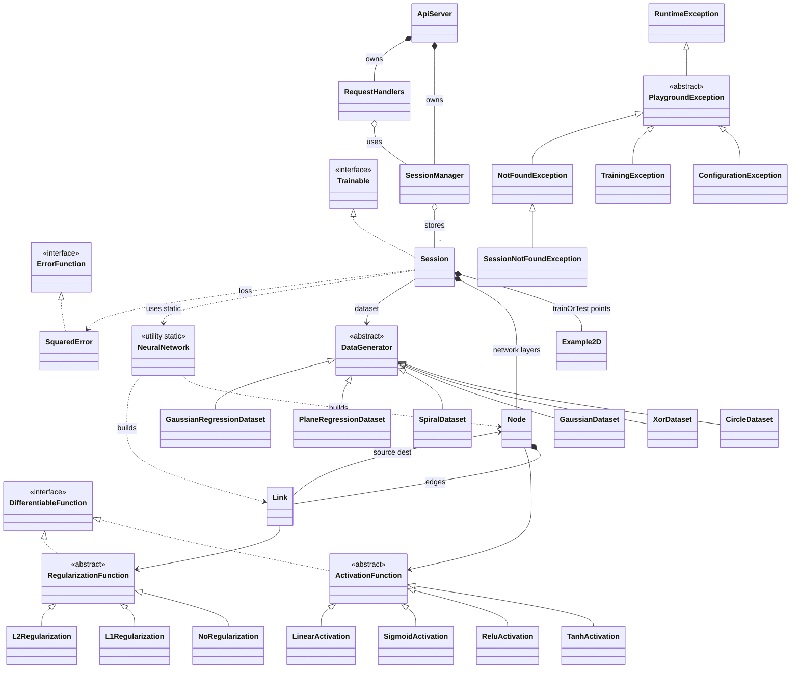

# Class relationships and per-file guide (UML-style)

This document explains **each Java source file** in `backend/src/main/java/com/playground` and describes **how classes relate** to one another—the same ideas you would narrate when walking through a **UML class diagram**. Relation names follow common textbook UML usage: **inheritance**, **interface realization**, **composition**, **aggregation**, **association**, and **dependency**.

---

## 1. How to read the relationship vocabulary

| UML-style relation | In Java terms | Typical multiplicity / note |
| ------------------ | ------------- | ----------------------------- |
| **Inheritance (IS-A)** | `class A extends B` | Hollow triangle toward the **parent** |
| **Interface realization (IMPLEMENTS)** | `class A implements I` | Dashed arrow to **interface** |
| **Composition (strong HAS-A)** | Whole owns parts; parts usually die with whole in the model | Filled diamond on the **owner** |
| **Aggregation (weak HAS-A)** | Whole references parts; parts can exist independently | Empty diamond on the **whole** |
| **Association** | Stable structural link (field, long-lived parameter) | Solid line; often labelled “uses / knows” |
| **Dependency (uses)** | Short-lived use (method parameter, local variable, static call) | Dashed arrow |

**Multiplicity shorthand used below:** `1`, `0..1`, `*`, `1..*`, `0..*`.

---

## 2. Big-picture structure (what your UML “slides” should show)

### 2.1 Layer overview

```
[ Main ] ──creates──► [ ApiServer ]
                           │
           ┌───────────────┼───────────────┐
           ▼               ▼               ▼
   [ SessionManager ]  [ RequestHandlers uses SessionManager ]
           │ composition
           ▼
      [ Session ]*  (many sessions in a map)
```

- **`ApiServer`** **composes** **`SessionManager`** and **`RequestHandlers`** (created inside `ApiServer`, same lifetime as the server instance).
- **`RequestHandlers`** **aggregates** access to **`SessionManager`** (injected constructor dependency; not owned by `RequestHandlers` in the sense of creating it—it’s the same instance owned by `ApiServer`).

### 2.2 Session as the “hub” of the domain model

**`Session`** is the central **composition** object:

| Role in Session | Type(s) | Relation to Session |
| --------------- | ------- | ------------------- |
| Identity | `String id` | value |
| Dataset (classification vs regression) | `DataGenerator` (+ `regDataset` for regression) | **association / composition** of behaviour objects |
| Activations / regularization | `ActivationFunction`, `RegularizationFunction` | **association** (typically 1 each, held as fields) |
| Input vector definition | `List<InputFeatures.Feature>` | **association** to enum instances |
| Training data | `List<Example2D>` train/test | **composition** of immutable points |
| Network | `List<List<Node>>` | **composition** of layered neurons (session rebuilds network) |
| Training loop | implements **`Trainable`** | **interface realization** |

**`Session`** **depends on** **`NeuralNetwork`** (static methods only—**dependency**, not “has-a NeuralNetwork instance”):

- `Session.rebuildNetwork()` calls `NeuralNetwork.buildNetwork(...)`.
- Training calls `NeuralNetwork.forwardProp`, `backProp`, `updateWeights`.

**`Session`** **depends on** **`SquaredError.INSTANCE`** (loss) — **dependency** on a **singleton** implementing **`ErrorFunction`**.

### 2.3 Neural network object graph

- **`NeuralNetwork`** (all-static utility) **creates and wires** **`Node`** and **`Link`** — factory/orchestrator **dependency** on those types.
- **`Node` composition:** each node **has exactly one** **`ActivationFunction`** (reference). It **composes** **`List<Link>`** for incoming and outgoing edges (the links are generally created when the network is built and owned by the graph structure).
- **`Link` composition:** each link **has two** **`Node`** references (`source`, `dest`) and **one** **`RegularizationFunction`** (strategy for weight penalty / L1 special case).

### 2.4 Parallel hierarchies (what to draw as three “columns” in UML)

1. **`DifferentiableFunction`** (interface) ← **`ActivationFunction`** (abstract) ← concrete activations.  
   **`RegularizationFunction`** (abstract) also **implements** **`DifferentiableFunction`** — two separate inheritance roots sharing one interface.

2. **`DataGenerator`** (abstract) ← six concrete dataset classes.

3. **`PlaygroundException`** (abstract) ← **`ConfigurationException`**, **`TrainingException`**, **`NotFoundException`** ← **`SessionNotFoundException`** extends **`NotFoundException`**.

### 2.5 Registries (static singletons / maps)

**`Activations`**, **`Regularizations`**, **`DatasetRegistry`** are **`final`** classes with **private constructors**. They **associate to** concrete function/dataset instances (often **1:1** named constants like `Activations.TANH`) and expose **`byKey(String)`** — **dependency** from API/config code into registry.

---

## 3. Mermaid class diagram (overview)

You can paste the block below into a Mermaid-compatible viewer. It is **intentionally simplified** (omit JDK types such as `HttpServer`, `Random`, `Map` details) to match lecture clarity.



---

## 4. File-by-file: purpose and relations

Paths are relative to `backend/src/main/java/com/playground/`.

### `Main.java`

- **Purpose:** JVM entry; parses port; constructs **`ApiServer`**, **`start()`**, registers shutdown hook.
- **Relations:**
  - **Dependency** → **`ApiServer`** (creates local variable, calls methods).
  - No fields—**no associations**.

---

### `api/ApiServer.java`

- **Purpose:** Embeds **`HttpServer`**; routes `/api/*` and `/health`; **`dispatch`** reads body, delegates to **`RequestHandlers`**; maps exceptions to HTTP status; CORS helper.
- **Relations:**
  - **Composition** → **`SessionManager`** (`private final sessions = new SessionManager()`).
  - **Composition** → **`RequestHandlers`** (`new RequestHandlers(sessions)` — same lifetime as server).
  - **Dependency** → **`PlaygroundException`** (catch and **`getHttpStatus()`** polymorphic dispatch).
  - **Dependency** → JDK **`HttpServer`**, **`HttpExchange`**, streams (not modelled as UML classes for the course).

---

### `api/RequestHandlers.java`

- **Purpose:** Route table implementation; parses JSON via **`Json`**; applies config to **`Session`**; trains; builds boundary payloads; serializes snapshots.
- **Relations:**
  - **Association** → **`SessionManager`** (`private final`; injected—stable reference).
  - **Dependency** → **`Session`**, **`Json`**, **`NeuralNetwork`**, **`Node`**, **`Link`**, **`Activations`**, **`Regularizations`**, **`DatasetRegistry`**, **`InputFeatures`**, **`Example2D`**, **`ConfigurationException`**, **`NotFoundException`**, **`TrainingException`** (method-scope usage).
  - **Uses locks** on sessions via **`SessionManager`** (concurrency, not a UML class).

---

### `api/SessionManager.java`

- **Purpose:** Holds **`Map<String, Session>`**; `create`, `remove`, `get`, **`require`** (throws **`SessionNotFoundException`**); optional idle cleanup; per-id **`ReentrantLock`**.
- **Relations:**
  - **Composition** (in the sense “container of sessions”) → **`Session`** **`*`** instances stored in map.
  - **Dependency** → **`SessionNotFoundException`**, **`NotFoundException`**.

---

### `api/Trainable.java`

- **Purpose:** Interface: **`trainOneEpoch(...)`**, **`getIteration`**, **`getTrainLoss`**, **`getTestLoss`**.
- **Relations:**
  - **Realization** ← **`Session`**.

---

### `api/Session.java`

- **Purpose:** Full training state + configuration; implements **`Trainable`**; rebuilds **`List<List<Node>>`**; generates data via **`DataGenerator`**; trains using **`NeuralNetwork`** + **`SquaredError`**.
- **Relations:**
  - **Realization** → **`Trainable`**.
  - **Composition / association** → **`DataGenerator`** (`dataset`, `regDataset` fields).
  - **Association** → **`ActivationFunction`**, **`RegularizationFunction`**.
  - **Association** → **`List<Feature>`** (`InputFeatures.Feature` enum instances).
  - **Composition** → **`List<Example2D>`** for train/test (collections owned by session lifecycle).
  - **Composition** → **`List<List<Node>>`** (network replaced on rebuild—owned by session).
  - **Inner enum** **`Problem`** — nested type; `fromKey` → **`ConfigurationException`**.
  - **Dependency** → **`NeuralNetwork`** (static), **`InputFeatures`**, **`DatasetRegistry`**, **`Activations`**, **`Regularizations`**, **`SquaredError`**, **`TrainingException`**, **`ConfigurationException`**.

---

### `nn/DifferentiableFunction.java`

- **Purpose:** Interface **`output`**, **`derivative`**.
- **Relations:**
  - **Realized by** → **`ActivationFunction`**, **`RegularizationFunction`** (both **implement**).

---

### `nn/ActivationFunction.java`

- **Purpose:** Abstract base for activations; holds name; implements **`DifferentiableFunction`**.
- **Relations:**
  - **Realization** → **`DifferentiableFunction`**.
  - **Parent** of **`TanhActivation`**, **`ReluActivation`**, **`SigmoidActivation`**, **`LinearActivation`** (**inheritance**).
  - **Associated from** → **`Node`** (each node holds one activation).

---

### `nn/activation/TanhActivation.java` (and **Relu**, **Sigmoid**, **Linear**)

- **Purpose:** Concrete **`output`** / **`derivative`** math.
- **Relations:**
  - **Inheritance** → **`ActivationFunction`**.
  - **Instantiated / registered** in **`Activations`**.

---

### `nn/activation/Activations.java`

- **Purpose:** `public static final` instances (**`TANH`**, …); static **`byKey`**, **`all()`**.
- **Relations:**
  - **Dependency / association** to every concrete **`ActivationFunction`** (owns references in map).
  - Called from **`Session`**, **`RequestHandlers`**, **`NeuralNetwork` build** path → **dependency from** those.

---

### `nn/RegularizationFunction.java`

- **Purpose:** Abstract base; **`crossesZero`** hook for L1; implements **`DifferentiableFunction`**.
- **Relations:**
  - **Realization** → **`DifferentiableFunction`**.
  - **Parent** of **`NoRegularization`**, **`L1Regularization`**, **`L2Regularization`**.
  - **Associated from** → **`Link`** (each link stores one regularizer).

---

### `nn/regularization/NoRegularization.java`, **`L1Regularization`**, **`L2Regularization`**

- **Purpose:** Concrete penalty + derivative; L1 overrides **`crossesZero`**.
- **Relations:**
  - **Inheritance** → **`RegularizationFunction`**.
  - **Registered in** **`Regularizations`**.

---

### `nn/regularization/Regularizations.java`

- **Purpose:** Same pattern as **`Activations`** for **`NONE`**, **`L1`**, **`L2`**, **`byKey`**.
- **Relations:**
  - References concrete **`RegularizationFunction`** instances; **used by** **`Session`**, **`Link`**, **`RequestHandlers`**.

---

### `nn/ErrorFunction.java`

- **Purpose:** Loss interface **`error`**, **`derivative`** (two arguments).
- **Relations:**
  - **Realized by** → **`SquaredError`**.
  - **Used by** → **`NeuralNetwork.backProp`** (via parameter type), **`Session`** passes **`SquaredError.INSTANCE`**.

---

### `nn/SquaredError.java`

- **Purpose:** Singleton **`INSTANCE`** implementing squared loss.
- **Relations:**
  - **Realization** → **`ErrorFunction`**.
  - **Dependency target** for **`Session`** / **`NeuralNetwork`**.

---

### `nn/Node.java`

- **Purpose:** Neuron; forward/backward steps; holds **`ActivationFunction`**, **`Link`** lists.
- **Relations:**
  - **Composition** → **`List<Link>`** (incoming/outgoing).
  - **Association** → **`ActivationFunction`** (1 per node, **`final`** reference).
  - **Bidirectional association** with **`Link`** (link endpoints reference nodes; nodes hold links).

---

### `nn/Link.java`

- **Purpose:** Edge between two **`Node`**s; weight update uses **`RegularizationFunction`**.
- **Relations:**
  - **Association** → **`Node`** `source`, **`Node`** `dest` (2, navigable).
  - **Association** → **`RegularizationFunction`** (strategy).
  - **Dependency** → **`Regularizations`** (default pass in constructor path—depending on how **`NeuralNetwork`** builds links).

---

### `nn/NeuralNetwork.java`

- **Purpose:** Static **`buildNetwork`**, **`forwardProp`**, **`backProp`**, **`updateWeights`**, **`forEachNode`**.
- **Relations:**
  - **No instance fields** — **utility** stereotype.
  - **Dependency** → **`Node`**, **`Link`**, **`ActivationFunction`**, **`RegularizationFunction`**, **`ErrorFunction`** (parameters and local graph walks).
  - **Creates** **`Node`** and **`Link`** objects inside **`buildNetwork`** (**dependency** + creational role).

---

### `data/Example2D.java`

- **Purpose:** Immutable **`(x, y, label)`** training point.
- **Relations:**
  - **Many-to-one composition parent** — referenced from **`Session`** train/test **`List`**s (**aggregation** of value objects).

---

### `data/InputFeatures.java`

- **Purpose:** **`enum Feature`** (`X`, `Y` with keys); **`build`**, **`parseKeys`**.
- **Relations:**
  - Enum implements behaviour via **`DoubleBinaryOperator`** — **strategy-like** fields per constant.
  - **Used by** **`Session`**, **`RequestHandlers`**, **`NeuralNetwork`/training via session** (feature list).

---

### `data/datasets/DataGenerator.java`

- **Purpose:** Abstract **`generate`**, **`getKey`**, **`isRegression`**; **protected** random helpers.
- **Relations:**
  - **Parent** of six dataset classes (**inheritance**).
  - **Referenced by** **`Session`** as **`dataset` / `regDataset`** (**association**).

---

### `data/datasets/CircleDataset.java`, **`XorDataset`**, **`GaussianDataset`**, **`SpiralDataset`**, **`PlaneRegressionDataset`**, **`GaussianRegressionDataset`**

- **Purpose:** Concrete **`generate`** implementations.
- **Relations:**
  - **Inheritance** → **`DataGenerator`**.
  - **Registered** in **`DatasetRegistry`** (static field constants).

---

### `data/datasets/DatasetRegistry.java`

- **Purpose:** Static registry **`byKey`**, preset **`CIRCLE`**, **`SPIRAL`**, etc.
- **Relations:**
  - **Association** to **`DataGenerator`** instances; **dependency from** **`Session`**, **`RequestHandlers`**.

---

### `exceptions/PlaygroundException.java`

- **Purpose:** Abstract base; **`httpStatus`**; **`final getHttpStatus()`**.
- **Relations:**
  - **Inheritance** → **`RuntimeException`** (JDK).
  - **Parent** of service-specific exceptions (**see below**).

---

### `exceptions/ConfigurationException.java`

- **Purpose:** HTTP **400**; invalid config.
- **Relations:** **Inheritance** → **`PlaygroundException`**.

---

### `exceptions/NotFoundException.java`

- **Purpose:** HTTP **404** base.
- **Relations:** **Inheritance** → **`PlaygroundException`**; **parent** of **`SessionNotFoundException`**.

---

### `exceptions/SessionNotFoundException.java`

- **Purpose:** Missing session id → 404.
- **Relations:** **Inheritance** → **`NotFoundException`** (multi-level chain).

---

### `exceptions/TrainingException.java`

- **Purpose:** HTTP **500**; training failures; may wrap **`cause`**.
- **Relations:** **Inheritance** → **`PlaygroundException`**.

---

### `util/Json.java`

- **Purpose:** Encode/decode minimal JSON for API; recursive walk **`Map`/`List`**.
- **Relations:**
  - **Dependency** from **`ApiServer`**, **`RequestHandlers`** (no domain types—**orthogonal infrastructure**).
  - Uses **generics** `Map<?, ?>`, `List<?>` — associative **dependency** on structure, not specific classes.

---

## 5. Narration cheat-sheet (for the “UML explanation” part of the presentation)

1. **Draw three columns:** (left) **exceptions** inheritance tree; (center) **`Session`** with **Trainable** + **composition** to **DataGenerator**, **ActivationFunction**, **RegularizationFunction**, **network**; (right) **`ActivationFunction`** and **`RegularizationFunction`** trees under **`DifferentiableFunction`**.

2. **Show object graph:** **`Node`**—**`Link`**—**`Node`** with **ActivationFunction** on nodes and **RegularizationFunction** on links; **`NeuralNetwork`** as **static orchestrator** (dashed dependencies, not a box with fields).

3. **Registries** (**`Activations`**, **`Regularizations`**, **`DatasetRegistry`**): one box each with **dependency** arrows from **`RequestHandlers`** / **`Session`**.

4. **Cross-cutting:** **`ApiServer`** catches **`PlaygroundException`** — one **polymorphic** edge from all concrete exceptions to the handler.

---

## 6. Companion artifacts in this repository

- Static diagram asset: **`uml_diagram.svg`** (visual UML generated for slides).
- OOP-to-code mapping: **`backend/OOP_DESIGN.md`**.
- Four-speaker outline: **`PRESENTATION_GUIDE.md`**.

---

*This document aims for **teaching completeness**: every backend file is listed, and every major inter-class link used in runtime behaviour is named in UML vocabulary.*
